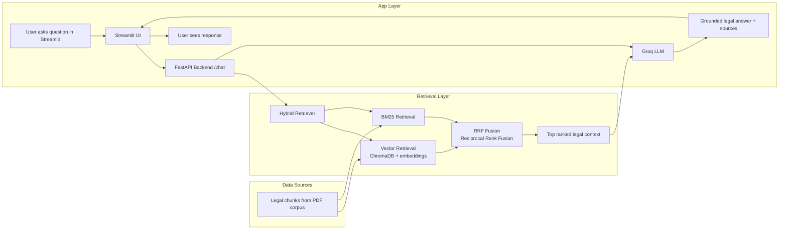

# Legal RAG Assistant

This project is a legal question-answering system built for Nepali legal documents using a hybrid retrieval pipeline. It combines:

- semantic vector search with ChromaDB and sentence-transformers
- keyword retrieval with BM25
- reciprocal rank fusion (RRF) to merge both retrieval signals
- a Groq-powered LLM for grounded legal answers
- a FastAPI backend for inference
- a Streamlit frontend for chat-style interaction

The system is designed to answer questions using the Civil Code, Penal Code, and Constitution as the primary source documents.

## What changed recently

The project has been upgraded from a vector-only retrieval pipeline to a hybrid RAG system:

- `src/bm25.py` adds BM25 keyword retrieval
- `src/retriever.py` now combines vector similarity and BM25 results using RRF
- `src/ingest.py` builds both the vector index and the BM25 index from the same chunked legal data
- `api/main.py` exposes the retrieval + generation pipeline through a FastAPI service
- `streamlit_app.py` provides a browser-based interface for asking legal questions

## Project structure

```text
LEGAL_MAIN/
├── api/
│   ├── main.py
│   └── routes/
│       ├── chat.py
│       ├── dependencies.py
│       └── schemas.py
├── data/
│   ├── acts/
│   └── vector_store/
├── src/
│   ├── __init__.py
│   ├── bm25.py
│   ├── document_loader.py
│   ├── embeddings.py
│   ├── ingest.py
│   ├── memory.py
│   ├── parsers.py
│   ├── rag_pipeline.py
│   ├── retriever.py
│   └── vector_store.py
├── config.py
├── ingest.py
├── main.py
├── pyproject.toml
├── README.md
├── requirements.txt
└──   streamlit_app.py  streamlit_app.py
```

## Prerequisites

Before running the app, make sure you have:

- Python environment managed with `uv`
- the legal PDF files placed in `data/acts/`
- a valid `GROQ_API_KEY` in a `.env` file at the project root

Example `.env`:

```env
GROQ_API_KEY=your_api_key_here
```

Required source files:

- `data/acts/civil_code.pdf`
- `data/acts/penal_code.pdf`
- `data/acts/constitution.pdf`

## Setup

From the project root:

```bash
uv sync
```

## Build the legal index

Run the ingestion step first. This loads the PDFs, chunks the legal text, embeds the chunks, and builds the BM25 index.

```bash
uv run python ingest.py --rebuild
```

This is required before starting the backend or the frontend.

## Run the application

Open separate terminals for each service.

### 1) Start the backend

```bash
uv run python -m uvicorn api.main:app --reload --port 8000
```

The API will be available at:

```text
http://127.0.0.1:8000
```

### 2) Start the Streamlit app

```bash
uv run python -m streamlit run streamlit_app.py
```

Then open the local URL displayed by Streamlit in your browser.

## How it works

1. `ingest.py` processes the legal PDFs and creates chunked document representations.
2. The vector store stores semantic embeddings for each chunk.
3. BM25 creates a keyword index over the same chunk list.
4. `RAGRetriever` performs hybrid retrieval using vector similarity + BM25 and merges them through reciprocal rank fusion.
5. `rag_pipeline.py` builds the grounded prompt and sends it to Groq.
6. The backend returns a structured result with the answer and sources.
7. Streamlit sends user questions to the backend and displays the answer in chat format.

## Example usage

Ask questions like:

- What is the legal procedure for a bill in the federal parliament?
- What are the penalties for theft under the Penal Code?
- What are the constitutional requirements for amendment of laws?

## API endpoint

The FastAPI backend exposes a POST endpoint:

```http
POST /chat
```

Request body:

```json
{
  "query": "What is the procedure for passing a bill?"
}
```

## Notes

- BM25 and vector retrieval are both persisted in the project’s vector store directory.
- The ingestion step rebuilds the stored legal index when you pass `--rebuild`.
- The Streamlit UI depends on the backend running at port `8000`.

## Optional CLI entry point

If needed, the root script can also be used for direct terminal-based retrieval:

```bash
uv run python main.py
```

This is useful for quick local debugging, but the main user workflow is:

1. ingest
2. backend
3. Streamlit UI

**Disclaimer:** This project is for research and educational purposes only. Its responses are generated from retrieved legal documents and should not be treated as legal advice. Users should consult the authoritative legal texts and qualified legal professionals for legal matters.

## Usage

```
"Punishment for robbery"
```

## Example Query

```text
Let's say a political party has a two-thirds majority in the House of Representatives but only around 10% of the seats in the National Assembly.

Can it pass ordinary bills, constitutional amendment bills, and other legislation?

If it cannot pass the bill, how will the government function if it wants to introduce new laws or amend existing legislation?

Explain all constitutional provisions, legal procedures, possible mechanisms, limitations, and exceptions. Provide a complete legal analysis with references to the relevant constitutional provisions and legal sources.
```

Answer: According to the Constitution of Nepal, Part-9 - Federal Legislative Procedures, Section 111, a Bill passed by one House of the Federal Parliament shall be transmitted to the other House as soon as possible. 

In this scenario, if the party has 2/3 seats in the lower house (House of Representatives) but only 10% of seats in the upper house (National Assembly), they can still pass a Bill in the lower house with a majority vote as per Section 99 of the Constitution of Nepal, Part-8 - Federal Legislature, which states that any motions submitted for decision in either House of the Federal Parliament shall be decided by a majority vote of the members present and voting.

However, when the Bill is transmitted to the upper house, it may face difficulties in passing due to the lack of majority seats. According to Section 111 (5) of the Constitution of Nepal, Part-9 - Federal Legislative Procedures, if the National Assembly does not return a Bill, except for a Money Bill, within two months from the date of receipt, the House of Representatives may, by a resolution passed by a majority of the total number of its existing members, present the Bill to the President for assent.

If the upper house rejects or passes the Bill with amendments, the lower house can still pass the Bill again with a majority vote, and present it to the President for assent, as per Section 111 (7) of the Constitution of Nepal, Part-9 - Federal Legislative Procedures.

In case of a disagreement between the two houses, the Bill can be referred to a joint sitting of both houses, and if the joint sitting passes the Bill, it can be presented to the President for assent, as per Section 111 (9) of the Constitution of Nepal, Part-9 - Federal Legislative Procedures.

If the government (PM) wants to introduce new amendments in laws, acts, or bills, they can do so by introducing a new Bill in the lower house, which can then be transmitted to the upper house for consideration.

In terms of the workings of the government, if the party is unable to pass the Bill, they can still continue to govern and make decisions through other means, such as executive orders or regulations, as long as they are within the scope of their constitutional powers.

However, if the government is unable to pass important legislation, it may face difficulties in implementing its policies and programs, which could lead to a constitutional crisis.

Sources:
- The Constitution of Nepal, Part-9 - Federal Legislative Procedures, Section 111
- The Constitution of Nepal, Part-8 - Federal Legislature, Section 99
- The Constitution of Nepal, Part-9 - Federal Legislative Procedures, Section 111 (5), (7), and (9)

It is worth noting that, according to the Constitution of Nepal, Part-9 - Federal Legislative Procedures, Section 111 (10), if the House of Representatives is dissolved or its term expires when any Bill introduced in the House of Representatives is under its consideration or when any Bill passed by the House of Representatives is under consideration in the National Assembly, such Bill shall lapse. 

Therefore, it is crucial for the government to manage its legislative agenda carefully and work with the upper house to pass important legislation, or to use other means to achieve its policy objectives.

## Architecture diagram



