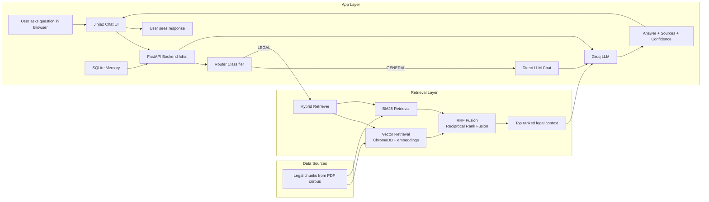

# Nepali Legal Chatbot

A RAG-based legal assistant for Nepali law with a natural conversational interface. Built with FastAPI, hybrid retrieval, and a Jinja2 frontend.

The system answers legal questions grounded in the Civil Code, Penal Code, and Constitution of Nepal, while also handling general conversation naturally like a standard LLM chatbot.

## Features

- **Router RAG**: Automatically detects legal vs. general questions. Legal queries trigger document retrieval; general chat flows naturally like a standard LLM.
- **Jinja2 + HTMX Frontend**: Clean chat UI with collapsible sidebar, conversation history, and markdown rendering — no React build step needed.
- **SQLite Memory**: Persistent conversation history with auto-titled sessions.
- **Hybrid Retrieval**: ChromaDB semantic search + BM25 keyword search merged via Reciprocal Rank Fusion (RRF).
- **Markdown Support**: Tables, lists, bold text, and blockquotes render beautifully in chat bubbles.

## Architecture



## Tech Stack

| Layer     | Technology                            |
| --------- | ------------------------------------- |
| Backend   | FastAPI, SQLAlchemy                   |
| Frontend  | Jinja2, HTMX, vanilla CSS             |
| Retrieval | ChromaDB, BM25, sentence-transformers |
| LLM       | Groq API (Router RAG pattern)         |
| Memory    | SQLite                                |

## Project Structure

```
LEGAL_MAIN/
├── api/
│   ├── main.py              # FastAPI app entrypoint
│   └── routes/
│       ├── chat.py          # Chat routes + HTMX handlers
│       ├── dependencies.py  # DB session dependency
│       └── schemas.py       # Pydantic models
├── src/
│   ├── __init__.py
│   ├── router.py            # LEGAL vs GENERAL classifier
│   ├── rag_pipeline.py      # Router RAG pipeline
│   ├── retriever.py         # Hybrid retriever (vector + BM25 + RRF)
│   ├── bm25.py              # BM25 keyword index
│   ├── vector_store.py      # ChromaDB wrapper
│   ├── embeddings.py        # Sentence-transformers manager
│   ├── memory.py            # SQLite conversation storage
│   ├── document_loader.py   # PDF ingestion
│   ├── parsers.py           # Text chunking
│   └── ingest.py            # Index builder
├── templates/
│   ├── chat.html            # Main chat page
│   └── partials/
│       ├── message.html     # HTMX message partial
│       └── chat_cleared.html
├── static/
│   └── style.css            # Chat UI styles
├── data/
│   ├── acts/                # Source PDFs
│   ├── vector_store/        # ChromaDB + BM25 indexes
│   └── conversations.db     # SQLite chat history
├── config.py                # Central configuration
├── ingest.py                # CLI entry point for indexing
├── requirements.txt
└── README.md
```

## Prerequisites

- Python 3.10+
- Legal PDFs placed in `data/acts/`:
  - `civil_code.pdf`
  - `penal_code.pdf`
  - `constitution.pdf`
- A valid `GROQ_API_KEY` in a `.env` file at the project root:

```
GROQ_API_KEY=your_api_key_here
```

## Setup

```bash
# Create virtual environment
python -m venv penv

# Activate (Windows)
penv\Scripts\activate

# Install dependencies
pip install -r requirements.txt
```

## Build the Legal Index

This loads the PDFs, chunks the text, builds embeddings, and creates the BM25 index.

```bash
python ingest.py --rebuild
```

> Run this whenever you add or change source documents.

## Run the Application

```bash
python -m uvicorn api.main:app --reload --port 8000
```

Open your browser at: **http://127.0.0.1:8000**

## How It Works

### Router RAG

Every user message is first classified by the LLM as **LEGAL** or **GENERAL**:

- **GENERAL** (e.g., "Hey, how are you?", "Tell me a joke", "What's photosynthesis?")
  - The LLM responds naturally using its training knowledge.
  - No documents are retrieved. No sources shown.

- **LEGAL** (e.g., "What is the punishment for theft?", "How do I pass a bill?")
  - Hybrid retrieval fetches the most relevant legal chunks.
  - The LLM generates a grounded answer citing document names and section numbers.
  - Sources and confidence scores are displayed.

### Hybrid Retrieval

1. **Vector Search**: Semantic similarity via ChromaDB + `all-MiniLM-L6-v2` embeddings.
2. **BM25**: Keyword-based ranking over the same chunk corpus.
3. **RRF Fusion**: Reciprocal Rank Fusion merges both rankings into a single ranked list.

### Conversation Memory

- All messages are stored in SQLite (`data/conversations.db`).
- The last 3 exchanges are injected into the prompt for context-aware replies.
- Conversations are auto-titled from the first user message.
- Click any conversation in the sidebar to resume it.

## API Endpoints

| Method | Endpoint                | Description                  |
| ------ | ----------------------- | ---------------------------- |
| GET    | `/`                     | Chat UI page                 |
| POST   | `/chat`                 | Send a message (form-data)   |
| POST   | `/new-chat`             | Start a fresh conversation   |
| GET    | `/history/{session_id}` | Load a specific conversation |
| DELETE | `/history/{session_id}` | Delete a conversation        |

## Example Queries

**General chat:**

- "Hey, what's your name?"
- "My name is Sandesh."
- "Tell me a joke."
- "What is photosynthesis?"

**Legal (triggers RAG):**

- "What is the legal procedure for a bill in the federal parliament?"
- "What are the penalties for theft under the Penal Code?"
- "What are the constitutional requirements for amendment of laws?"

## Configuration

Edit `config.py` to customize:

```python
EMBEDDING_MODEL_NAME = "all-MiniLM-L6-v2"
GROQ_MODEL_NAME = "openai/gpt-oss-120b"  # or your available Groq model
GROQ_TEMPERATURE = 0.1
GROQ_MAX_TOKENS = 1024
DEFAULT_TOP_K = 5
```

## Disclaimer

This project is for **research and educational purposes only**. Its responses are generated from retrieved legal documents and should not be treated as legal advice. Users should consult the authoritative legal texts and qualified legal professionals for legal matters.

## License

MIT